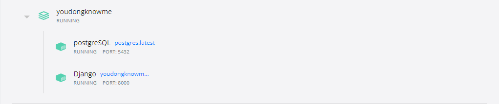

#  Crawlling Repository

----
## Pre Requirement

- Initiate docker to up [postgres, django, etc]

  

----
## 데이터 크롤링을 위한 레포지토리
[ Crawling Repository ]
  

----

Target Site Information

  

|크롤링 순위|사이트 주소|
|------|---|
|1|동양미래대 컴소과 공지사항|
|2|사이트2|타겟2|
|3|사이트3|타겟3|

---

  

## Usage

To get started with the project, start Airflow, Django, PostgreSQL in docker using the following command:

    docker-compose up -d

Wait for a few seconds and you should be able to access the 
  
Airflow - http://localhost:8080/
  
Django - http://localhost:8000/

To stop running the project, run the following command:

    docker-compose down

